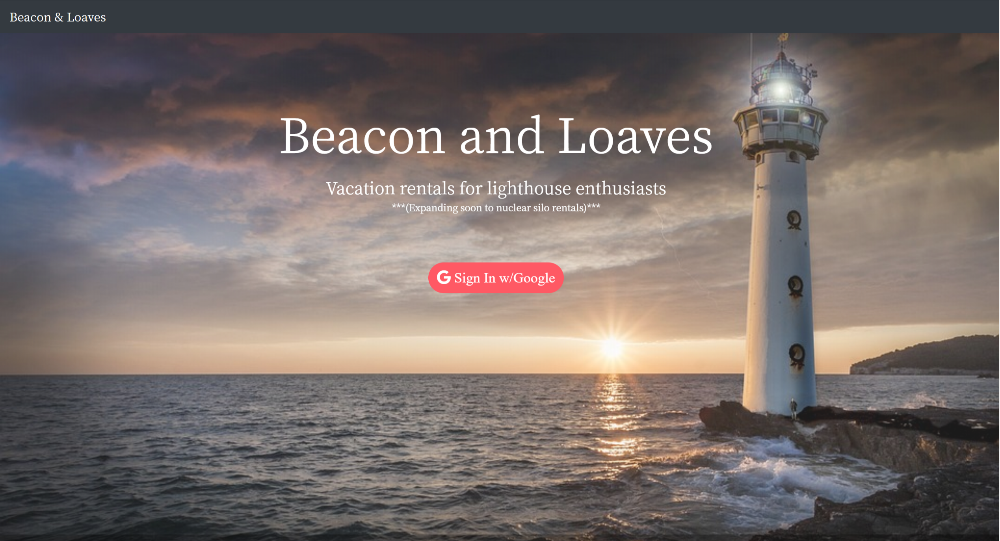
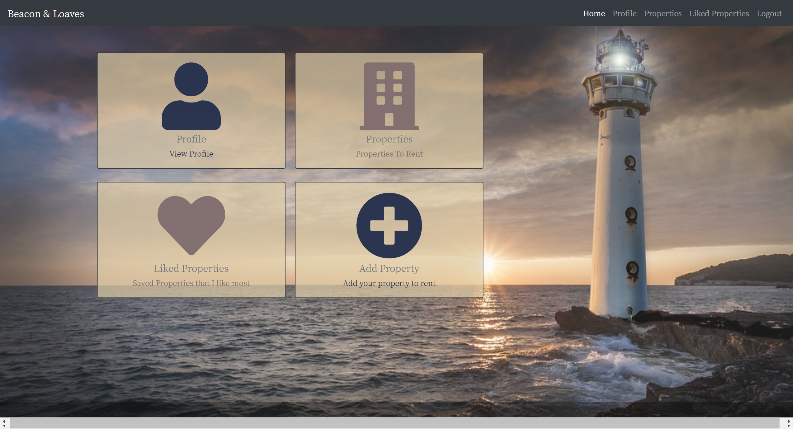
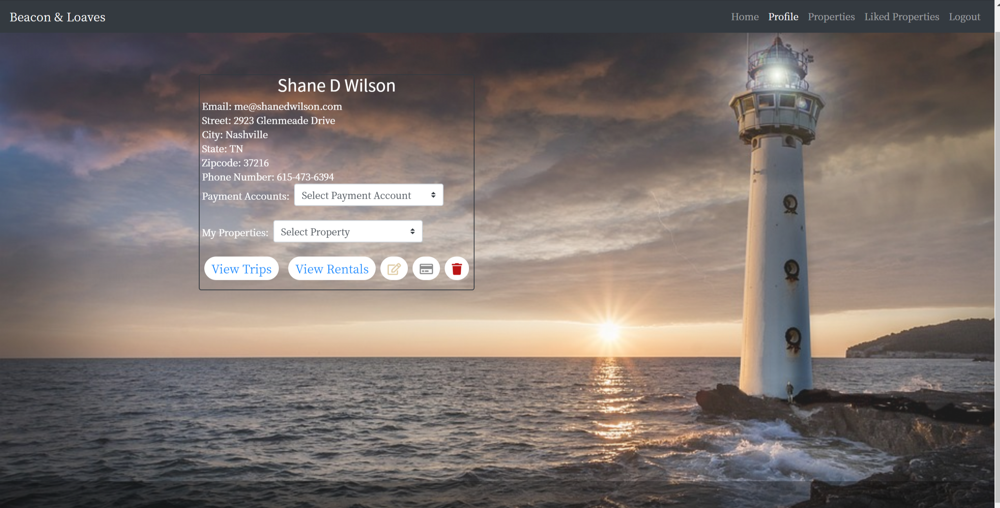
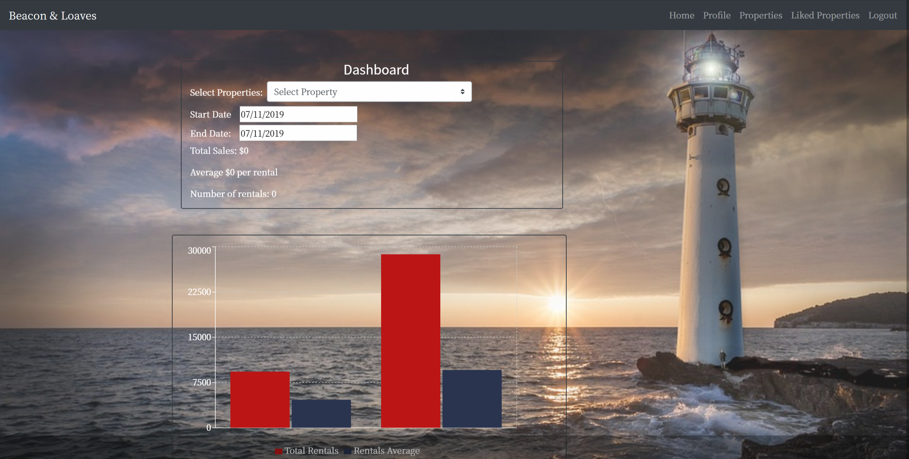
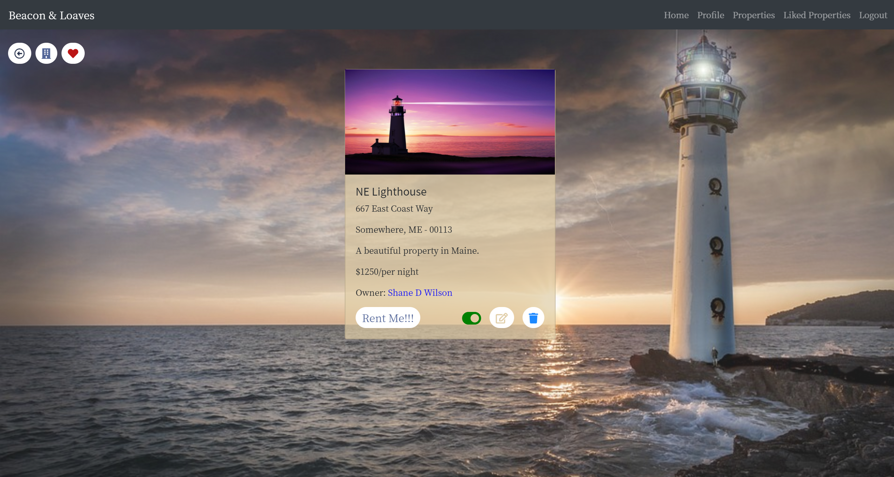

# Beacon And Loaves
This app was created by Ripal Patel, Rob Rice and Shane D Wilson as our final group project for our C#/.Net back-end course work at Nashville Software School. Beacon and Loaves is a short term rental app for the light house (or nuclear silo) enthusiast.

The app provides the user with a selection of coffee beans. The user may then add coffee beans to their private inventory. From the inventory page, the user may select a bean to use for creating a roast profile. On the roasts page all profiles are accessible and the user may choose to create an attempt of that roast. When a roast is selected, the user is routed to a page containing all of their attempts at that roast.

The user has the ability to add, edit and delete their inventory and roast attempts. Add, edit and delete functionality of the beans and roasts is reserved for the app owner.

Each page provides search functionality by bean region or name or, on the attempts page, by attempt date.

The attempts page has graphing for all of the attempts of a roast with time vs temperature on first crack, second crack and the end of the roast.

## Tech Used
* React.js
* C#/.Net/
* Boostrap
* Reactstrap
* React libraries including React Search Field and React Animated CSS
* Planning with Github Projects

## Screenshots






## How to run this project:

* Setup Firebase  
  -Create a firebase project  
  -Enable 'Google Authentication'  
  -Create an apiKeys.js file (an example file exists in the 'helpers' folder)
  -Copy firebase keys from firebase web app settings into apiKeys.js

* Clone or download the repo

* Browse to the repo directory in your terminal

* In the ClientApp folder of the project run ```npm install``` to install necessary dependencies

* Run the project from Visual Studio

## Thank You To:
* Nathan Gonzalez (NSS E8 Backend Chief Badass)
* Martin Cross (NSS E8 Backend Assistant Badass)
* Adam Wieckert (NSS E8 Backend Assistant Badass)
